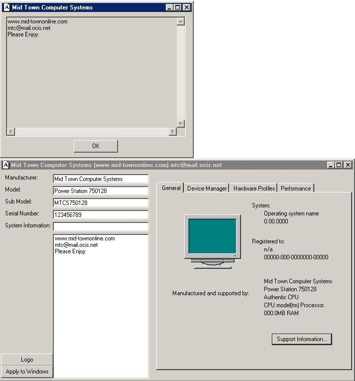



## Winsys

### Description

On computers like compaq's, when you right click on My Computer under the general tab you have a button (system info OEMINFO.INI ) and a logo ( OEMLOGO.BMP) , Well this code allows you to put your own Logo and Information about the computer into System Properties, Take a Good look, It's verry handy.
 
### More Info
 
None, But please vote for me, and if you like my code, tell other people about it. and if you use my code in a app or stand alone Please give me and or my company some credit for it. Thanks.

             |
---                |---
**Submitted On**   |2000-12-31 13:44:34
**By**             |[Trunner](https://github.com/Planet-Source-Code/PSCIndex/blob/master/ByAuthor/trunner.md)
**Level**          |Intermediate
**User Rating**    |5.0 (65 globes from 13 users)
**Compatibility**  |VB 6\.0
**Category**       |[Windows System Services](https://github.com/Planet-Source-Code/PSCIndex/blob/master/ByCategory/windows-system-services__1-35.md)
**World**          |[Visual Basic](https://github.com/Planet-Source-Code/PSCIndex/blob/master/ByWorld/visual-basic.md)
**Archive File**   |[CODE\_UPLOAD1321712312000\.zip](https://github.com/Planet-Source-Code/trunner-winsys__1-13987/archive/master.zip)

